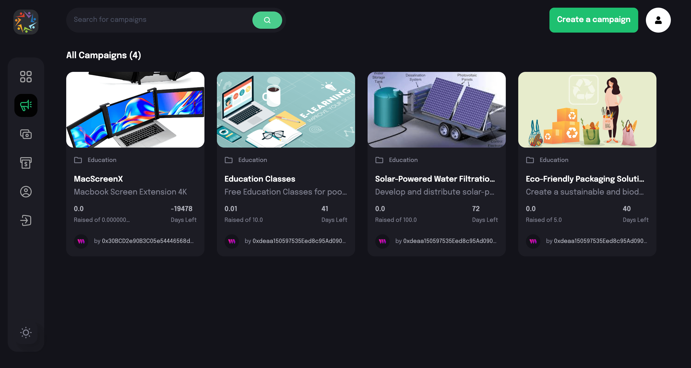
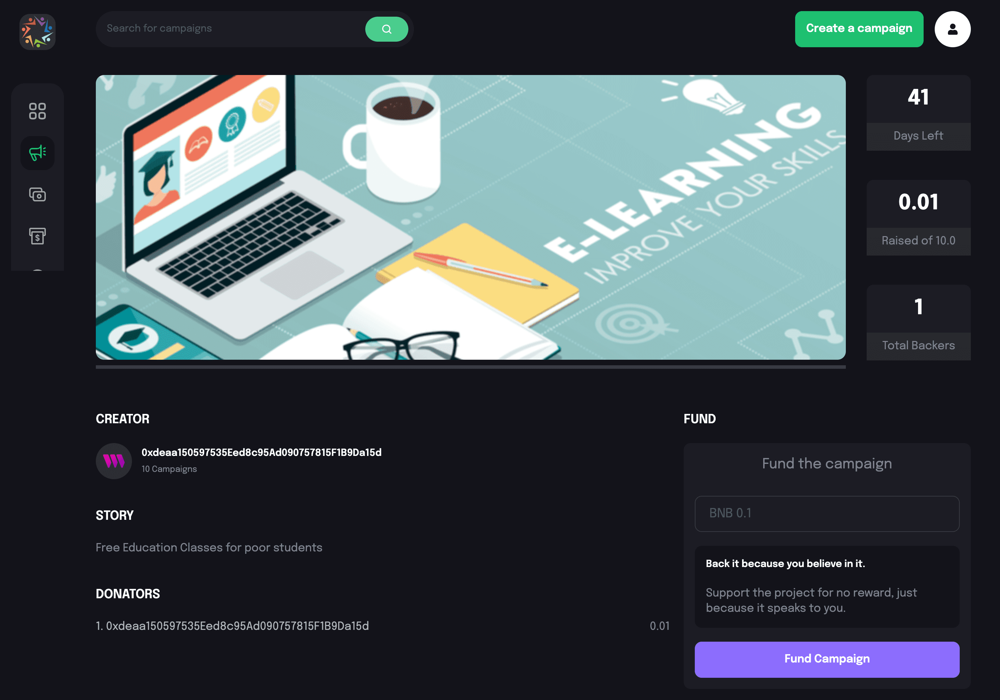
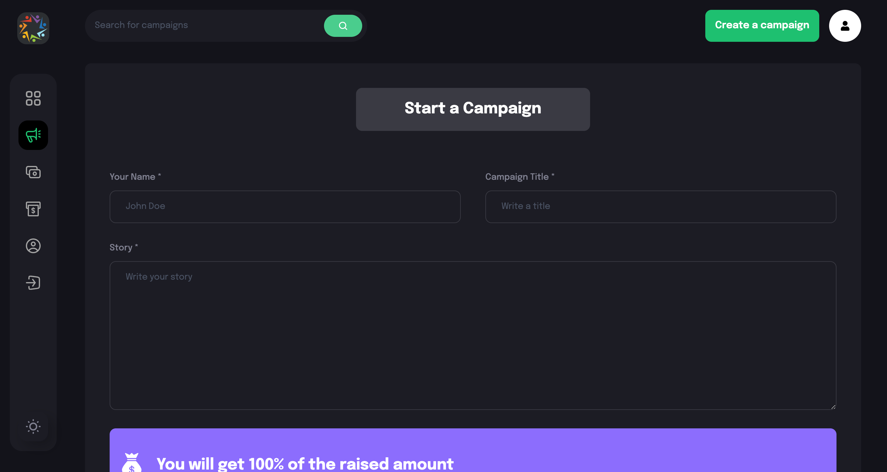
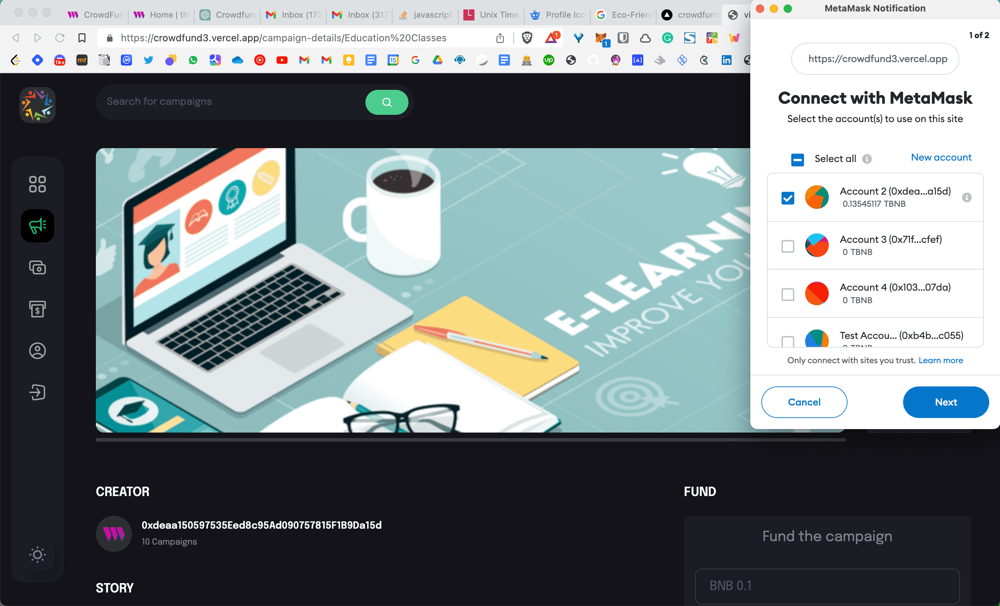

# CrowdFund3
CrowdFund3 is a decentralized ecosystem for raising funds, supporting creators, and making donations to support needy people and non-profit organizations built on **Mantle Network**. We are trying to solve real-world problems using the concept of Decentralized Autonomous Organisation.

### Smart Contract (on Binance Testnet)
CrowdFund3 Marketplace- 0xBf74142818c2e5E42F7f7349a1Af02a1Dcd5814D

## Core Objectives & Features -
* 🔗 Connect: We bridge the gap between the real world and the web3 world by enabling projects, creators, and non-profit organizations to get funds and support seamlessly. We enable people to create their own NFT DAOs. 
* 🙏 Support: We aim to support real-world projects by leveraging Blockchain at its core. CrowdFund3 is providing a much better approach to solving crowdfunding and donation platform problems that exist in current web2 platforms.
* 💵 Reward: CrowdFund3 provides a new way of raising funds. Everyone who funds, support, or donates via CrowdFund3 will get a unique project-related NFT for their contribution that can be verified on-chain. Later, by holding NFTs, HODLers can earn yield whenever Creator or Project makes profits.
* 🔔 Update: With the help of EPNS and CrowdFund3 DAO, users are notified whenever there is any update from the project, creators, or organizations after they got funding.
* 🌍 CrowdFund3 DAO: DAO members will take all the essential decisions like accepting the listing proposal, distribution of funding, and distribution of profit for the smooth functioning of the platform.
* 🎯GOAL: Our Ultimate Goal is to connect & support people using blockchain in such a way that they can leverage the technology and bring some positive changes in the world.

### Main features
* For Projects - Verified Projects by DAO will be listed on the platform to raise funds. NFTs will be distributed to every project funder. Later when the project earns profit, there will be a distribution of profit on basis of NFT type to all project funders.
* For Creators - Verified Creators can raise funds for their new work like releasing a new song, a short movie on Youtube, etc, and get initial support from their supporters through CrowdFund3. Later creator will share part of their profit or exclusive access to all of the supporters who bought Supporter NFT.
* For Donations - It is our initiative to support a non-profit organization in creating a real impact in the world by using the power of decentralization. Using CrowdFund3, you can support and help verified non-profit organizations. Every donator will get a unique NFT for their donation.
* Our Donation platform solves the issue of making donations in a secure and trustless way.
It provides an opportunity for donators to make donations by being completely anonymous but on the other hand they can prove to someone that they have donated to this organization by showing their NFTs and on-chain transactions.
* It solves the lots of issues that people are facing in making donations in the current web3 system like they can not verify that they have done a donation without revealing their identity to another person. But in CrowdFund3, they can hide their identity and still verify their donation on-chain.

* It has the potential to bring the next wave of users to the blockchain, making web3 stronger than ever.

### Some Screenshots of the current Web App
**Landing Page**
 
**Project Page**

**Listing Page**

**Connecting Wallet**

